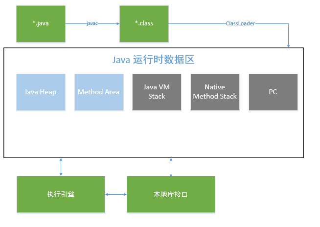

### JVM体系结构
***
对jvm整体了解
*  ####jvm体系结构
	- jvm的基本组成：
        1. 指令集
        2. 类加载器
        3. 执行引擎
        4. 运行时数据区
        5. 本地方法区
    - 整体架构如下图：
		

* #### PC
	程序计数器，**线程私有**。计数器的值可以为undefined,此时线程正在执行的是Native方法。
* #### JVM Stack
	java虚拟机栈，**线程私有**。每个方法在执行的时候创建==栈帧==，存储局部变量表，操作数栈、动态链接等，方法从调用到执行完成对应栈帧在虚拟机栈中的出入栈。
    **可能出现的异常是栈溢出StackOverflowError和内存溢出OutOfMemoryError。**
    
* #### 本地方法栈
	和虚拟机栈类似，只不过是Native方法服务。
    
* #### 方法区
	**线程共享** 存储已被虚拟机加载的类的信息、常量、静态变量等数据。其重要的一部分是运行时常量池。关于常量池有专门一节分析。[常量池](ConstantPoolTable.md)
    
* #### java 堆
	**线程共享** 存放对象的实例。在Java虚拟机规范中规定：所有对象实例以及数组都要在堆上分配。java 堆是GC的主要区域。