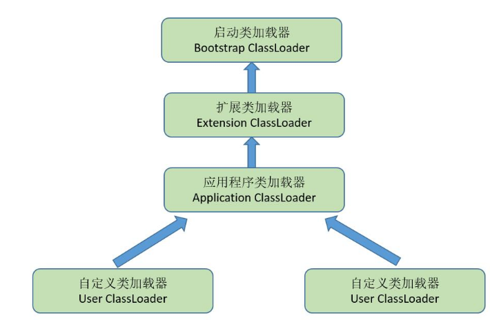

# 双亲委派模型
***
关于加载阶段已在[加载](Loading.md)中分析，文章最后讲到在java开发者角度，可以将类加载器分为三类：启动类加载器、扩展类加载器和应用程序加载器。我们所编写的应用都是由这三类加载器相互配合进行加载的，当然jvm也运行我们加入自己定义的类加载器。java设计者==推荐==给开发者一种类加载器实现的模型：双亲委派模型。
#### 双亲委派模型
如下图所示：
		

可以看出除了顶层的启动类加载器之外，其余的类加载器都有父类加载器，自定义的加载器之间都是使用组合的方式复用其父类加载器。
* ##### 双亲委派模型的工作方式
如果一个类加载器收到类加载的请求，它首先不会自己去尝试加载这个类，而是把这个请求**委派**给父类加载器去完成，因此所有的加载请求最后都会传送到最顶层的启动类加载器中，只有当父类加载器无法完成这个加载请求时，将这以信息反馈给子类，子类加载器才尝试自己去加载
#####此模式带来的好处#####
java类随着它的加载器一起具备了一种带有优先级的层次关系。越是基础的类，越是被上层的类加载器进行加载，保证了java程序的稳定运行
* ##### 双亲委派模型的实现逻辑
实现双亲委派模型的代码都集中在java.lang.ClassLoader的loadClass()方法中.
基本逻辑：首先检查是否已经被加载过，若没有就调用父类加载器的loadClass(),如果父类为空（说明此时为启动类加载器）则使用启动类加载器，如果父类加载失败，抛出ClassNotFoundException的异常后，在调用自己的findClass()进行加载

#### “破坏”双亲委派模型
上面已经提及双亲委派模型只是java设计者推荐的一种模型，并非强制性的。虽然被普遍遵循，但是有时为了达到某些功能目的，需要对此模型进行“破坏”，例如线程上下文类加载器（Thread Context ClassLoader）的出现和为了实现程序的动态性的OSGi

